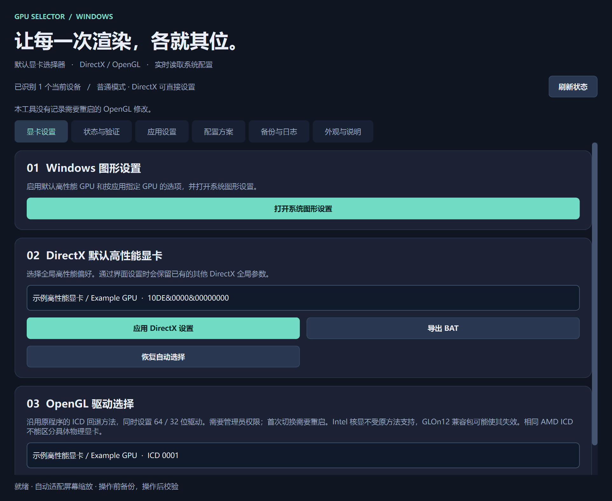

# GPU Selector · 默认显卡选择器

**2.0.1-beta · 首个公开测试版 · 64 位 Windows 10/11**

用 Python 和 PySide6 编写的中文图形界面工具，管理 Windows GPU 偏好、查看当前设置，并通过独立探针检查实际渲染设备。基于 [nethe-GitHub/select_default_GPU](https://github.com/nethe-GitHub/select_default_GPU) 改编，保留原工具的 Windows 图形设置、DirectX 默认高性能显卡、OpenGL ICD 选择及 BAT 导出功能。

**[下载 Windows EXE](https://github.com/Freeze7y/gpu-selector/releases)**。发布版无需安装 Python；源码和构建方式见下文。



## 功能

- **全局设置**：DirectX 默认高性能 GPU、恢复自动选择、32 / 64 位 OpenGL ICD 选择。
- **按应用管理**：为桌面 EXE 设置自动、节能或高性能偏好；保留 HDR 等其他参数。
- **实际探针**：分别检测 32 位和 64 位 OpenGL 渲染器；创建 Direct3D 11 默认硬件设备并执行离屏清色及像素回读。
- **修改预览与恢复**：显示修改前后差异，检测预览期间的外部更改；修改前备份、修改后读回，失败时尝试回滚并校验。
- **状态管理**：备份列表、操作日志导出、OpenGL 重启状态、显卡驱动版本和设备问题代码。
- **配置与界面**：命名方案、设备及驱动匹配检查、深浅主题、字体大小、窗口位置与大小记忆，支持缩放和小窗口滚动。
- **离线许可**：“外观与说明 → 查看开源许可证与第三方声明”可直接查看随 EXE 附带的许可文本。

## 使用

1. 从 [Releases](https://github.com/Freeze7y/gpu-selector/releases) 下载 EXE 并运行，在“状态与验证”查看配置，在“备份与日志 → 显卡健康”查看设备信息。
2. 在“显卡设置”选择全局目标，或在“应用设置”选择实际运行的 EXE 和 GPU 偏好。检查修改预览后再应用。
3. OpenGL 系统修改需要管理员权限。重新以管理员身份运行后，仍需再次选择并确认；首次采用原工具的 OpenGL 方法需要重启。
4. 应用偏好修改后，完整退出并重新启动目标程序，再运行探针或通过任务管理器的“GPU 引擎”列检查该程序。
5. 在“配置方案”保存常用设置；在“备份与日志”检查恢复资格、预览并恢复备份，或导出操作日志。

默认数据目录为 `%LOCALAPPDATA%\GPUSelector`，包含 `backups/`、`profiles/`、`operations.jsonl`、`opengl-reboot.json` 和 `ui.json`。数据保存在本机，不会自动上传。

## 验证范围与限制

这个版本已完成：

- **122 项自动化测试**，覆盖注册表操作计划、回滚与恢复、应用偏好、方案匹配、探针、日志、重启状态和界面交互。
- 源码及打包 EXE 的 `--smoke-all` 检查：32 位 OpenGL、64 位 OpenGL、Direct3D 11 三个实际探针均通过，成品测试退出码为 0。
- Direct3D 11 离屏清色后的像素回读；界面页面、小窗口、主题和字体适配检查。

**尚未实机验证真实显卡配置切换、UAC 授权流程和重启后的切换效果。**测试没有修改真实 GPU 配置；真实写入、失败回滚和恢复逻辑使用模拟注册表验证。因此本版以公开测试版发布。

使用时请区分以下结果：

- 注册表读回成功表示配置与目标值一致；探针结果只代表该探针进程。不同 API 或应用可以使用不同显卡。
- 应用页的自动 / 节能 / 高性能由 Windows 决定具体物理 GPU，不提供任意指定某一张卡；应用自行选卡时可能不遵循偏好。请指定真实执行渲染的 EXE，启动器的设置不保证由子进程继承。
- 原 OpenGL ICD 回退方法受到 Intel 核显 ICD、GLOn12 兼容包和应用自选 GPU 等因素影响；共用 ICD 的显卡不能仅凭 DLL 路径区分。
- 重启提示只跟踪本工具记录的 OpenGL 修改。睡眠、快速启动关机和系统时钟变化可能使判断不确定；使用 Windows“重启”后再实测。
- 方案应用前校验用户、电脑、显卡和驱动。驱动更新或硬件变化后请重新保存。未知或 Windows 自定义具体 GPU 的应用项不能转换为方案，可取消包含应用偏好后保存全局方案。
- 独立 BAT 有读回校验，但没有图形界面的自动备份、回滚和修改预览。备份不是系统还原点；探针也不是显卡压力测试。

## 从源码构建

源码文件直接放在仓库根目录，独立 x86 探针运行时放在 `probe32/`。使用 **64 位 Python 3.12**，在仓库根目录打开 PowerShell：

```powershell
py -3.12 -m venv .venv
& .\.venv\Scripts\Activate.ps1
.\build.ps1
```

`build.ps1` 安装固定版本依赖、运行测试，再使用 `GPUSelector.spec` 构建。输出为 `dist\GPU默认显卡选择器.exe`。请保留 `probe32/` 整个目录；其中的官方 Python x86 嵌入式运行时作为数据打包，不应加入主程序的 x64 DLL 依赖集合。来源、校验值和许可见 `probe32/README.md`。

已安装依赖后可单独运行测试：

```powershell
& .\.venv\Scripts\python.exe -m unittest discover -s . -p 'test_*.py' -v
```

只读烟雾测试使用临时数据目录，不改变日常使用的窗口设置，不应用 GPU 配置：

```powershell
$gpuSmoke = Join-Path $env:TEMP ('GPUSelector-smoke-' + [guid]::NewGuid().ToString('N'))
& .\.venv\Scripts\python.exe .\gpu_selector.py --smoke-all $gpuSmoke
Get-Content -LiteralPath (Join-Path $gpuSmoke 'results.json')
```

它会打开界面、遍历页面、读取离线许可证、运行三个探针，并保存截图、`report.txt` 与 `results.json`。成功时 `gl64`、`gl32`、`dx`、`licenses` 均为 `true`，进程退出码为 0。发布 EXE 也支持 `--smoke-all <输出目录>`。

## 反馈

可在 [Issues](https://github.com/Freeze7y/gpu-selector/issues) 报告问题。请说明 Windows 版本、程序版本、操作步骤、预期与实际结果。日志和备份可能包含应用路径、账户或设备标识；公开上传前请删除这些个人信息。

## 归属与许可证

本项目是 [nethe-GitHub/select_default_GPU](https://github.com/nethe-GitHub/select_default_GPU) 的改编作品，**改编日期：2026-09-06**。本版增加 Python 图形界面、验证探针和配置管理，并保留原项目归属。

本项目按 **GNU Affero General Public License v3.0（AGPL-3.0）** 提供，完整文本见 [LICENSE](LICENSE)。以前内部版本中出现的“GPL-3.0”文字为标注错误，本公开版已更正为 AGPL-3.0。第三方组件保留各自许可证；随附 Python 运行时的许可证见 `probe32/LICENSE.txt`，其他随附许可和说明见 `third-party/THIRD_PARTY_NOTICES.md` 及该目录中的许可文件。

Qt / PySide6 6.11.2 按 LGPLv3 使用；对应源码压缩包随 [v2.0.1-beta Release](https://github.com/Freeze7y/gpu-selector/releases/tag/v2.0.1-beta) 提供。可按本仓库构建步骤重新构建程序，并依第三方说明替换或重建库。本程序按现状提供，不提供担保。

## English

GPU Selector is a Python/PySide6 Windows utility with a Chinese UI. It manages global and per-EXE GPU preferences, previews and backs up changes, and runs separate 32-bit OpenGL, 64-bit OpenGL and Direct3D 11 probes. Download the standalone EXE from [Releases](https://github.com/Freeze7y/gpu-selector/releases); Python is only needed to build from source.

**2.0.1-beta is the first public test release.** All 122 automated tests and the three real probes passed, including the packaged EXE smoke test. Actual GPU configuration switching, UAC and post-reboot switching behavior have not been tested on a real machine. Probe results apply only to the probe process. Per-app modes express Windows preferences and do not select an arbitrary physical adapter.

Adapted on **2026-09-06** from [nethe-GitHub/select_default_GPU](https://github.com/nethe-GitHub/select_default_GPU), under **AGPL-3.0**. Third-party components retain their own licenses.

## Star 数与增长趋势

[](https://github.com/Freeze7y/gpu-selector)

[](https://starchart.cc/Freeze7y/gpu-selector)

图表由 [Starchart](https://starchart.cc/Freeze7y/gpu-selector) 提供。若图表因服务限流暂时无法加载，可打开统计页稍后查看；当前 Star 数以上方徽章和 GitHub 仓库显示为准。
