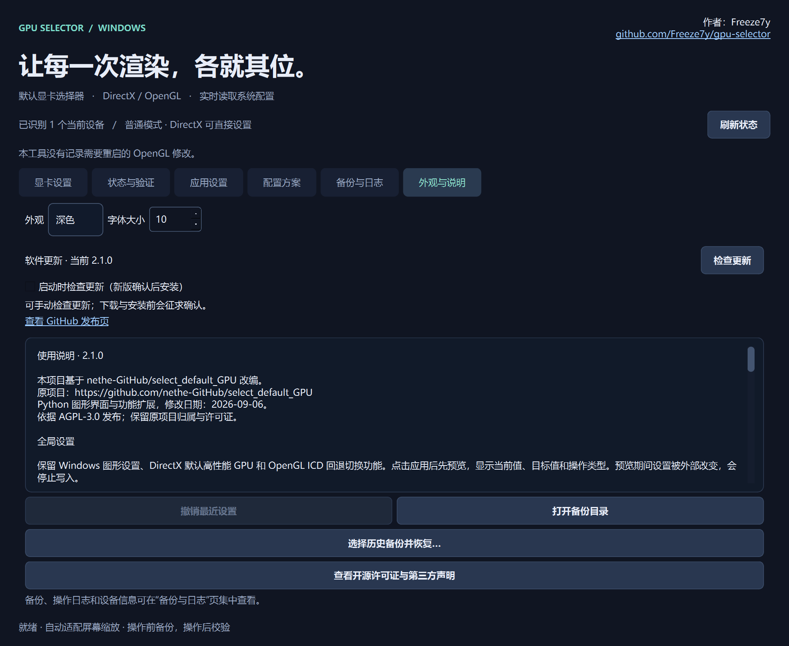

# 检查与安装更新

从 **2.1.0** 起，发布 EXE 支持从 [Freeze7y/gpu-selector](https://github.com/Freeze7y/gpu-selector/releases) 检查和安装新版本。更早的版本没有这个按钮，需要先手动下载一次 2.1.0 或更新版本。

## 使用方式

- **手动检查**：进入“外观与说明”，点击“检查更新”。
- **启动检查**：首次正常启动会询问是否开启，选择会保存；之后可在“外观与说明”随时开关。开启后每次启动检查，发现新版仍需确认，不会直接静默覆盖。
- **安装新版**：确认后后台下载，核对 GitHub 提供的文件大小与 SHA-256。检查通过后退出当前程序，覆盖同一路径的 EXE 并重新打开。
- **正式版通道**：正式版只提示更高的正式版本，跳过草稿和测试版；不会自动降级。

源码运行可以检查新版本并前往发布页下载；在线原位替换仅用于打包的 Windows x64 EXE，不会把 Python 源码替换成 EXE。烟雾测试和独立探针不会触发启动询问或自动联网。

## 文件与数据

更新只替换正在运行的程序 EXE。GPU 设置、配置方案、备份和日志仍保存在原数据目录。更新前保留旧 EXE；替换或新程序启动失败时会尝试恢复旧版本，不覆盖更新期间由其他程序改动的目标文件。

程序目录必须可写。放在桌面等个人目录的 EXE 通常可直接更新；如果目录权限不足，更新会停止，当前程序保持原状。请关闭其他同路径程序实例后重试。

不要移动正在下载或安装更新的 EXE。下载中断、文件校验失败、GitHub 限流或网络不可用时，可以稍后重新检查；也可从发布页手动下载。清理更新缓存前应确认没有更新任务在运行。

每次安装的旧 EXE 保存在数据目录 `updates/<任务编号>/previous.exe`，结果写入同目录的 `result.json`。如果无法自动恢复，请先查看这份结果，保留旧 EXE，关闭相关程序后再处理。关闭窗口时会等待正在进行的网络请求取消或超时，不会强制终止下载线程。

## 更新来源与隐私

更新只读取本仓库的公开 GitHub Release，要求匹配的 Windows x64 EXE 名称与 SHA-256。HTTPS 使用 Windows WinHTTP 的证书验证；不关闭证书检查、不申请 GitHub 登录或访问令牌，不上传 GPU 设置、备份、应用路径或操作日志。

SHA-256 用于发现损坏或与发布信息不一致的文件，不等于 Windows 数字签名。发布 EXE 尚未附带代码签名。
